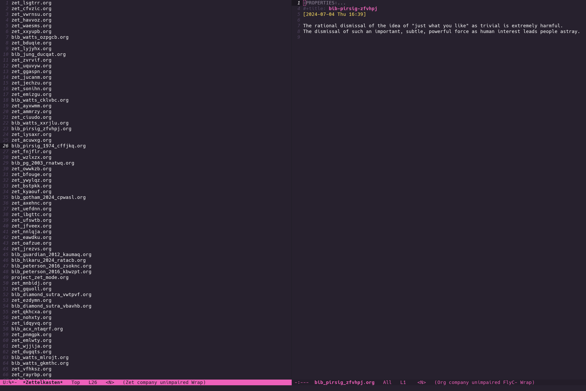
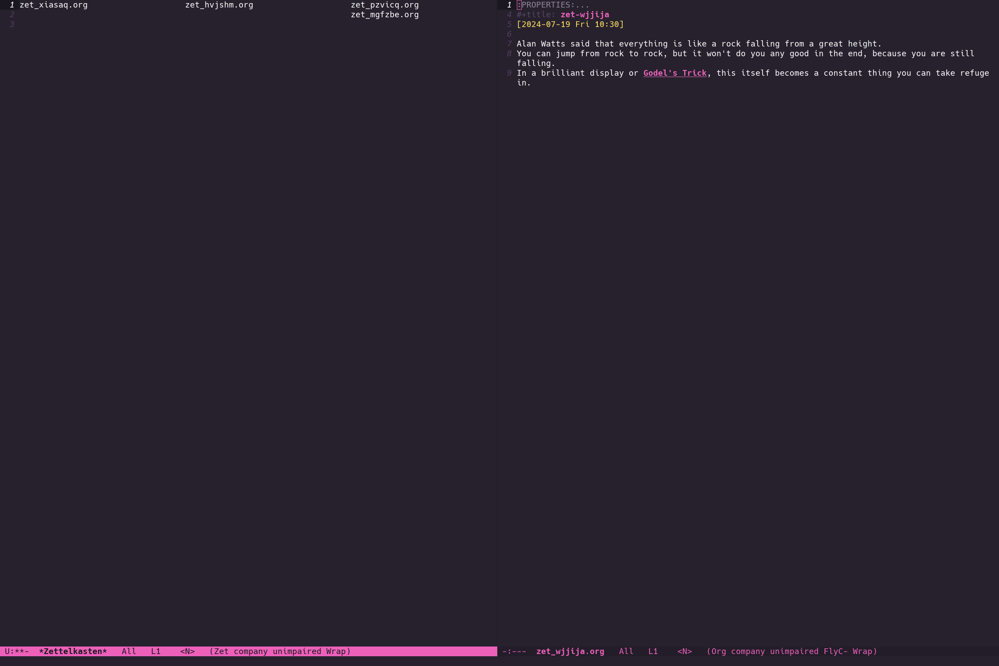

# zet-mode: A major mode for interacting with your org-roam Zettelkasten

## What's a Zettelkasten?
German for slip-box, a [zettelkasten](https://en.wikipedia.org/wiki/Zettelkasten) is a place where you collect lots of small, self-contained thoughts which are linked together.
As time goes on you can have a kind of conversation with your slip-box, reading lines of thought that have developed over long spans of time, elaborating on them and refining them.
For more information on this system, I'd recommend the book [How to take Smart Notes](https://www.amazon.ca/dp/B09V5M8FR5?_encoding=UTF8&linkCode=gg2&linkId=891da1bd51bb4996052321caa069a587&tag=takesmartno0e-20&creative=9325&camp=1789).

## Why this mode?
It's fun to collect little notes using [org-roam](https://www.orgroam.com/) but the resulting notes are not really structured in the same way as Luhmann's original zettelkasten.
The main issue is that org roam doesn't encourage the treelike branching structure of links that Luhmann considered so helpful.
This mode adds:
- A way to view of all your notes in chronological order.
- A way to view a current "selected" note, all the notes that link to it, and all the notes that it links to. Navigating between the three different columns allows you to easily browse different lines of thought.
- Commands to start capturing new thought notes or bibliographic notes continuing on from the current note.
- Commands to capture new thought notes or bibliographic notes.

## Any fun pictures?
Sure! This is what the main timeline view looks like:

This is what the column view looks like (there are not many notes in my columns yet):

